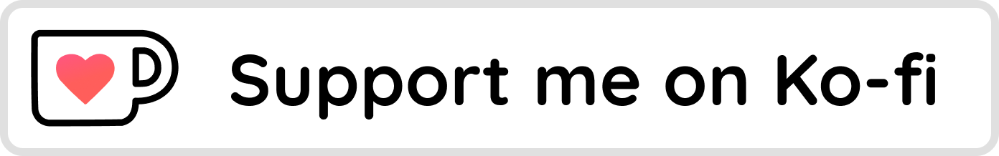

	
	 
	<h1 style="font-size:30px">FalseMusic</h1>
	
	 
	
	
	

### FalseMusic
*FalseMusic* es un launcher para bots de discord que integra la API de Google 'YouTube Data API' para buscar videos y reproducirlos posteriormente.

------------

### Descarga y Ejecución
Descarga `ds-falsemusic-launcher.exe` y `ds-falsemusic-[version].jar`.

------------

### Como se usa
Abre el launcher, introduce el `bot token` y has click en `iniciar`.

Una vez iniciado tendrás disponible una lista de comandos para buscar y escuchar música.

- `/search [nombre de la canción o artista]`
- `/play [youtube url]`
- `/skip`
- `/stop`
- `/leave`

También puedes usar `/help` o `/info` para obtener información extra.

------------

### Soporte
El programa es totalmente gratuito y está bajo la licencia `MIT`. Puedes apoyar con una pequeña cantidad a mi kofi.

